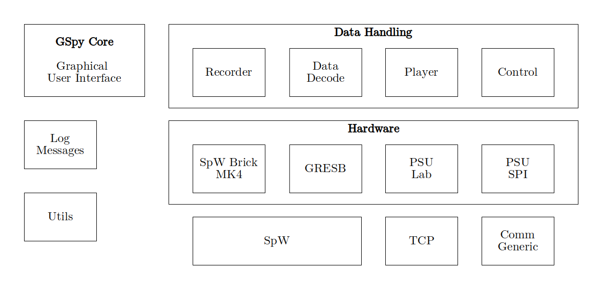

GSpy (Ground Support Python) is a software system aiming to provide all required features for component tests of space engineering projects. This includes features to send input data, receive output data, control the power supply and more as required.

The first steps of GSpy development were implemented in three bachelor's theses:
- 2017: Implementation of GSpy Classic with Qt GUI interface
- Integration of STAR-Dundee SpaceWire Brick Mk4 into GSpy Classic
- 2024: Implementation of GSpy Next concept

GSpy aims to support current Windows Operating Systemes, Linux support might be of interest for the further development, but is not a priority.

# GSpy Next
GSpy Next has been developed in a bachlors thesis in 2024. It is build on a network-focussed approach, where hardware-accessing components are accessible through a TCP network connection and a custom binary protocol. There are currently few features implemented, but the approach might prove to be advantageous when orchestrating more complex test setups where devices connected to different PCs might be controlled. Additionally, the networking approch allows for isolation of concerns through multiprocessing on a single machine.

_GSpy Next might prove to be an appropriate basis for further development. It contains few features and would need to be structured appropriately for extensions to be well-isolated and structured. There is currectly no graphical user interface. This opens the chance to isolate the UI properly from the program logic to allow for separation of concerns and possibly an additional command line interface for advanced automation._

## Requirements
- Python

## Installation
- Install Python 3.13
- Change cmd directory to appropriate program folder
- create venv: C:\Users\<user>\AppData\Local\Programs\Python\Python313\python.exe" -m venv venv
- update pip (in venv dir): python.exe -m pip install --upgrade pip
- install dependencies into venv: pip install strictyaml path numpy dill

## Configuration
- GSpy Next Core is configured through the config.yaml file
  - The ServerSocket by default binds to 127.0.0.1 Port 4444
  - The ServerSocketDummy by default binds to 127.0.0.1 Port 5555

## Startup
- Connect USB Space Wire Brick
- Start Server Socket: python3 ServerSocket.py
- Start GSpy Client Core: python3 core.py

## Open Work
- Error Signalisation through the Network Socket
- Error Message when no Server is available
- Check if protocol is appropriate and well-specified
- Implement any useful functionality for the client side.
- Make Tool stop on terminate signal

## Development
- PyCharm can be used for Development
- With Python 3.13 use at least PyCharm 2024.3, older versions will cause issues

# GSpy Classic
GSpy Classic is a Python and Qt based, extensible graphic application providing features to interact with the SpaceWire Brick Mk4, a serial console for controlling a laboratory power supply and an SPI connector Box (Onyx SPI) for communication to the on-board power supply. GSpy Classic integrates all features into a single application meaning all external components need to be connected to the same control PC.

_While GSpy Classic offers many features and a good-looking graphical user interface, there are stability problems affecting the software and the code might result difficult to maintain. The plugin system will be required to be refactored to be compatible with Python versions from Python 3.12. The last supported Python 3.11 will have end-of-life in 2027-10. The Qt5 Framework used for the graphical interface had public EOL in 2023, extended lifecycle ends May 2025, so an upgrade will also be required. The architecture of the software will probably lead to many complicated problems regarding the use of correct threading to avoid blocking the graphical user interface. Comprehensive testing will be required if the development of this solution should be continued._

## Requirements
- Windows OS
- Python Modules as listed in main.py
- Python 3.6 to 3.11
  - Update regarding module loading would be required for 3.12ff
- Python Windows Embeddable package may be used to avoid systemwide installation
- Qt development environment
- Install Scripts are outdated, use the process from this README instead

## Installation into venv
- Create a venv for the project based on Python 3.11
- open windows cmd in venv: gspy\venv\Scripts
- update pip: python.exe -m pip install --upgrade pip
- install dependencies into venv: pip install pyserial pyqtgraph qtawesome matplotlib pympler pygit2 dill numpy pythonnet
  - It is important to install pyserial and not serial

## Features and Components

### SpaceWire Brick 
At startup, the software decides to either use a dummy mode, or connect to a SpaceWire Brick Mk4 depending on if it finds a connection to the brick.
In dummy mode, some features are inaccessible.

The connection to the SpaceWire Brick is included through a module named Juice. This builds on the Python API provided by STAR-Dundee.

### Laboratory Power supply
The connection to the laborytory power supply uses a standard serial connection.

### Onyx SPI
The integration of the Onyx SPI connector is dependent on .NET .dll files and uses them to communicate to the device. Almost surely, this feature is incompatible with Linux.

## TODOs:

### 06-03-2025

1. Renovate the GUI from classic version to next version
	- Migrate to Python 3.13 (module loading -> packages approach)
	- Use PyQt v6 for new version 
2. Separate GUI, interfaces and data handling (read,write and generate)
3. First data logging from SpW protocol
4. Decoding SpW protocol 
5. User interface for decoding 
6. Creating a System Test - Loop Test Using Two SpW Devices
7. Testing with the testbed from Rui-FGPA

* SpW
* SPI power supply
* Laboratory Power Supply   
* Gresb bridge  
	* Check support in classic version

---
### 14-03-2025

The figure below illustrates the first block structure for the latest version of GSpy.

# GSpy-GUI
The GSpy GUI package contains a miminum working version of the GUI environment aiming to be a foundation for a new plugin loading system.

Environment:
- Python 3.13
- Windows, Linux or even macOS
- PyQT 6

The Basic GSpy GUI without any plugins does contain a detachable log window and a console.

## Console in GSpy
The console is a Widget that is provided by consolewidget.py. 
It currently exposes the following commands:
shell <command> - Execute a command using the system shell
exec <statement> - Execute a python statement
exit - Seems to do nothing

It would be useful to open this console to provide specific commands in plugins.
Currently, however this does not seem to be implemented.

## Resource Bundle
To build the ressource bundle used for things such as logos and images, the qt rcc compiler is needed.
macOS: brew install qt

A comprehensive ressource bundle should include all fonts used in the application:
- Source Code Pro
- DejaVu Sans Mono
- ...

To make a proper open-source version of the software, the licenses of the fonts must be checked and the fonts replaced if required.