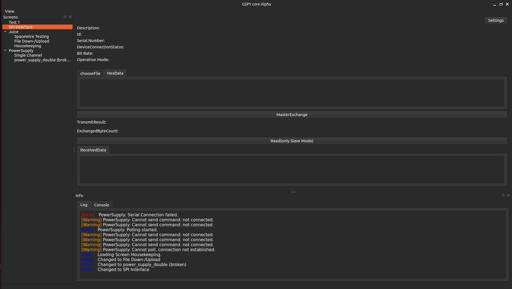

========================
GSpy-egse Python Package
========================

.. image:: https://img.shields.io/pypi/v/gspyegse.svg
   :target: https://pypi.python.org/pypi/gspyegse

.. image:: https://img.shields.io/travis/none/gspyegse.svg
   :target: https://travis-ci.com/none/gspyegse

.. image:: https://readthedocs.org/projects/gspyegse/badge/?version=latest
   :target: https://gspyegse.readthedocs.io/en/latest/?version=latest
   :alt: Documentation Status

GSpy is a Python package for the verification of space instruments.

- Free software: BSD License
- Documentation: https://gspy-egse.readthedocs.io

Installation
------------

1. Clone this repository.
2. Create and activate a new Python virtual environment.
3. From the root folder of the cloned repository, install the package with GUI support:

   .. code-block:: bash

      pip install .[gui]

4. After installation completes, launch the GSpy GUI with:

   .. code-block:: bash

      gspy-egse-gui

Demo GUI (2025-05-12)
---------------------

