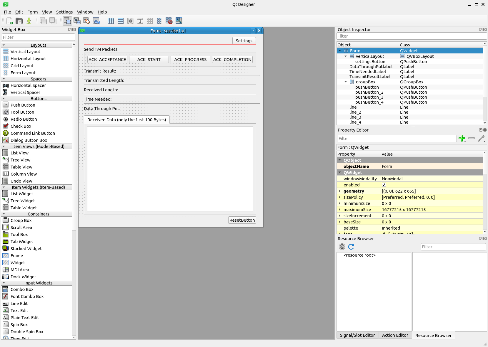

# GSpy Development Guide

## Including the DHU Simulator into a Custom View

Creating a new screen for a DHU Simulator requires interaction with four files inside the `gui` folder of the Python package. These files define the front end of the window for users, the back end of the window, and the interaction with the hardware for sending packets over the SpaceWire protocol. As an example of this process, a simulator for **Service 1** was created and will be used in this tutorial. 

---

### Preliminaries on Service1 Implementation

#### What is a CCSDS + PUS TM packet?


In space systems, every piece of data exchanged between an on-board unit and the ground segment must follow standardized communication protocols** to ensure interoperability between different equipment and agencies. Two of the most important standards are:

- **CCSDS (Consultative Committee for Space Data Systems)**  
  Defines how *space packets* are formatted and transmitted (header, length, sequence, etc.).  
  This is the *low-level communication layer* shared across spacecraft subsystems.

- **PUS (Packet Utilisation Standard)**  
  Defines the *application-level meaning* of those packets — i.e., what each packet is used for, and how services are structured.  
  It sits *on top of CCSDS* and describes the logical content of each packet (telecommands, telemetry, acknowledgements, etc.).

Together, they form a CCSDS + PUS TM packet, which can be seen as a structured container:

```
+----------------------+---------------------------+----------------------+
| CCSDS Primary Header | PUS Telemetry Header | Payload (Optional)        |
| 6 bytes              | 4 bytes              | Variable length           |
+----------------------+---------------------------+----------------------+
```


- The **CCSDS Primary Header** identifies the packet and ensures it can be routed and validated correctly.
- The **PUS TM Header** describes which *service* and *subservice* this telemetry belongs to.
- The **Payload** contains the data (optional; sometimes just status bytes or progress indicators).

#### The Role of “Service 1” (Request Verification)

In the **PUS** specification, services are grouped by functionality. **Service 1** is called **“Request Verification”**, and it is used to confirm the execution status of previously sent telecommands (TC). Every telecommand issued to a spacecraft must produce one or more corresponding telemetry packets (TM) that describe how the command was handled.

| Subservice  | Name                        | Typical Meaning                          |
|-------------|-----------------------------|------------------------------------------|
| 1           | Acceptance Successful       | Command accepted for processing          |
| 3           | Start Successful            | Command execution has started            |
| 5           | Progress Report             | Intermediate update (optional `step_id`) |
| 7           | Completion Successful       | Command execution completed successfully |

Thus, **Service 1 telemetry packets** are essentially acknowledgements or status updates about commands sent to the spacecraft (or simulator, in your case).

#### How This Applies to the DHU Simulator

In GSpy project:

- The **DHU Simulator** emulates the behavior of a spacecraft unit (the Brick Mk4 hardware).
- When the simulator or hardware receives a command, it replies with a **Service 1 TM packet** that reports the command’s execution status.
- A function in plugins creates these packets manually, following the **CCSDS + PUS** structure.

---

### Implementation of the Service1


The implementation of Service 1 mainly relies on four files:

```bash
gspy_egse/
└─ gui/
   ├─ screens/
   │  └─ simulator.py                 # add the simulator to the GUI
   ├─ ui/
   │  └─ service1.ui                  # Qt Designer: button layout for simulator
   ├─ plugins/
   │  └─ juice/
   │     └─ BrickMk4_Plugin_service1.py  # bind buttons to background tasks
   └─ utils/
      └─ pus_parser.py                # TM message parser
```

Creating these four files enables the transmission of TM packets over the SpaceWire BrickMK4 according to the service specifications. A description of each file is provided below.


#### `simulator.py` (in `screens/`)

The `screens/` folder contains entry points for different GUI windows or screens. Each file in this folder acts as a bridge between the GUI framework and the plugin/widget implementation, making it easy to register new screens and keep the GUI modular. The `simulator.py` file registers the Simulator screen within the GUI framework of the `gspy_egse` package. It imports the `BrickMk4Service1Widget` class from the plugin (`plugins/juice/BrickMk4_Plugin_service1.py`) and exposes it as the **main widget** of this screen. It also defines metadata:

  - `SCREEN_NAME` → the name displayed in the GUI (`"Simulator"`).  
  - `VERSION` → version tag of this screen (currently `1`).  
  - `MAIN_WIDGET` → the widget that provides the graphical interface and logic.  


#### `service1.ui` (in `ui/`)

The `ui/` folder stores Qt Designer interface files (`.ui`), which define the graphical layout of windows, dialogs, and widgets used in the GUI. These files are created visually with Qt Designer and later loaded dynamically by the application. The `service1.ui` file defines the layout for the Simulator screen. It specifies how the GUI elements (e.g., buttons, labels, containers) are arranged, leaving the functionality (logic and event handling) to be implemented in the corresponding Python plugin.  




#### `BrickMk4_Plugin_service1.py` (in `plugins/juice/`)

This plugin implements the Simulator logic that communicates with the SpaceWire Brick Mk4 hardware and parses returned TM (Telemetry) packets. It:

- Loads the `service1.ui` form (via `importlib.resources` + `uic.loadUi`) and wires up buttons/signals.  
- Builds and sends CCSDS/PUS TM packets to the device.  
- Receives results, parses TM using `parse_tm_packet`, and updates the GUI.  
- Supports **dummy mode** (no hardware attached) to keep the UI usable for demos.  
- Provides helper methods for buffering, transmission, and quick stress testing.  


#### `pus_parser.py` (in `utils/`)

The `pus_parser.py` module parses **CCSDS** primary headers and **PUS (Packet Utilisation Standard) TM** headers from raw byte lists. It produces a structured `ParsedTM` object used by the Simulator plugin to render concise telemetry summaries (e.g., `TM[1,5] Progress`) and optional `step_id` values.


---

### Workflow of Service 1 Operation

Once all the above components are in place, the **Service 1 simulator** operates as follows:

1. **Launch GSpy GUI**  
   Run the GSpy application. The main interface loads all available screens and plugins.

2. **Open the Simulator Screen**  
   In the GUI, navigate to the **SpaceWire Group** and select the **Simulator** tab (registered by `simulator.py`).

3. **User Interaction (Front-End)**  
   The GUI layout defined in `service1.ui` presents four main buttons, each representing one of the Service 1 subservices:  
   - TM [1,1] Acceptance  
   - TM [1,3] Start  
   - TM [1,5] Progress  
   - TM [1,7] Completion  

4. **Plugin Execution (Back-End)**  
   When the user clicks a button:
   - The corresponding **signal** (Qt event) triggers a slot in `BrickMk4_Plugin_service1.py`.  
   - The plugin calls `_build_tm_packet()` to create the corresponding CCSDS + PUS telemetry packet.  
   - The packet is queued and sent through the active **SpaceWire connection** (`SpaceWireConnection` + `BrickMk4` driver).

5. **Hardware / Dummy Processing**  
   - If the Brick Mk4 hardware is connected, it transmits and receives packets in real time.  
   - If the simulator is in **dummy mode**, no hardware is required — the GUI mimics responses for demonstration.

6. **Telemetry Reception and Parsing**  
   - When a response is received, the plugin’s `displayResults()` method is triggered.  
   - It uses the `parse_tm_packet()` function from `pus_parser.py` to decode the telemetry fields and display them in the text console area.

7. **GUI Update**  
   - Labels and text fields in the GUI are updated to show transmission results, throughput, and decoded TM summaries.  
   - The user can then send another subservice or reset the device.
