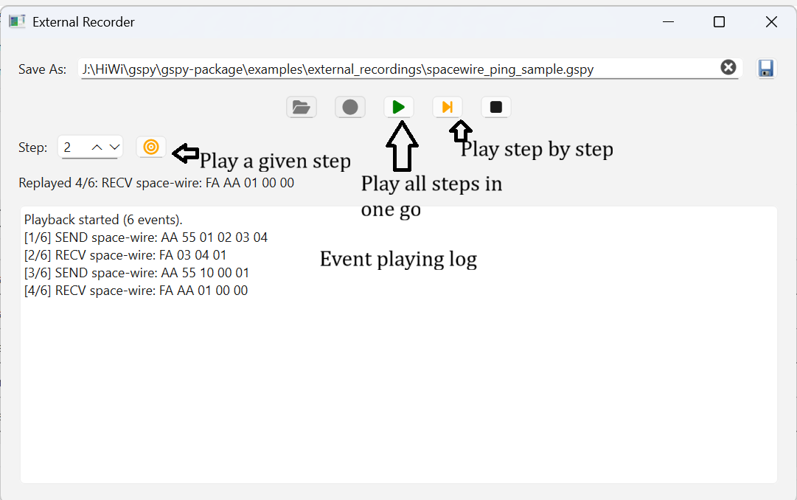

# GSpy External Recorder Documentation

The External Recorder in GSPY-EGSE package has undergone a major refactor to become a more integrated and intelligent component that handles recording, replaying, and logging of EGSE (hardware) interactions. It now connects seamlessly with multiple hardware modules (like SpaceWire and PowerSupply), provides a richer GUI for playback control, and ensures safe replaying without accidentally commanding real devices.

The recorder and its integrations are implemented in the following files:

```
gspy-egse/
├── src/
│   └── gspy_egse/
│       └── gui/
│           ├── utils/
│           │   └── externalRecorder.py        # Core recorder: logging, handlers, UI bindings
│           └── hardware_modules/
│               ├── spacewire.py               # Registers replay handler; skips TX during replay
│               └── powersupply.py             # Registers replay handler; simulates commands
└── examples/
    └── external_recordings/                   # Sample recordings for testing and demos
        ├── mixed_bus_sequence.gspy            # Mixed SpaceWire + Power Supply session
        ├── power_supply_ramp_sample.gspy      # Power supply ramp replay example
        └── spacewire_ping_sample.gspy         # Simple SpaceWire ping replay example
```

---


## Key Features

### Modular Event Dispatch and Handler Integration

The External Recorder implements a modular architecture based on dynamic handler registration. Each hardware module, such as SpaceWire or Power Supply, registers a replay handler that defines how recorded events are processed during playback. When a session is replayed, the recorder dispatches each event to its corresponding handler, allowing multiple hardware modules to respond simultaneously and consistently. This mechanism ensures that every subsystem reacts to the replayed data exactly as it would during a real operation, maintaining functional integrity without requiring physical connections.

### Structured Logging and Session Tracking

Every recording and playback session is fully traceable through structured logging. The recorder logs start, stop, save, and load events, as well as each dispatched step throughout the replay process. This provides complete visibility into how and when actions occur, both in the user interface and the underlying log output. Such transparency makes it easier to debug, validate, and audit recorded sessions while developing new hardware features or verifying communication protocols.

### Interactive User Interface Controls

The graphical interface includes a dedicated set of controls for managing the External Recorder. Users can record new sessions, load previously captured `.gspy` files, and control playback through stateful buttons that adapt to the current operation mode. Manual navigation between steps is supported, along with a “Go To” control and a numerical step selector, enabling precise execution of a single event or range of events. The interface also includes a playback log pane that displays recorder activity in real time, allowing operators to monitor progress and confirm handler responses.

### Safe Simulation Mode for Hardware Replays

To prevent unintended actions on physical equipment, the recorder activates a simulation mode whenever a replay is in progress. In this mode, hardware modules recognize that `is_replaying` is true and therefore avoid issuing real commands to connected devices. Instead, the SpaceWire module logs the intended payload transmission, while the Power Supply module replays the recorded commands and updates its internal telemetry cache to emulate device behavior. This separation between simulated and live operations guarantees hardware safety and enables safe debugging, even when the system is connected to real interfaces.

### Example Recordings and Validation Scenarios

A set of representative recordings is included in the `examples/external_recordings/` directory to demonstrate how the External Recorder operates across different hardware contexts. These recordings include `mixed_bus_sequence.gspy`, which combines multiple communication buses, `power_supply_ramp_sample.gspy`, which simulates gradual voltage adjustments, and `spacewire_ping_sample.gspy`, which replays a simple packet exchange. Each example can be loaded directly through the External Recorder UI to validate replay handler registration, observe module responses, or verify new features introduced in subsequent versions of the GSPY-EGSE environment.

### User Interface Overview

The External Recorder interface provides intuitive controls for managing recording and playback sessions. It includes buttons for starting and stopping a recording, loading saved `.gspy` files, and navigating between replay steps. The playback log pane displays real-time feedback about dispatched events and handler responses, while the step selector and “Go To” controls enable fine-grained navigation through the recorded sequence.

